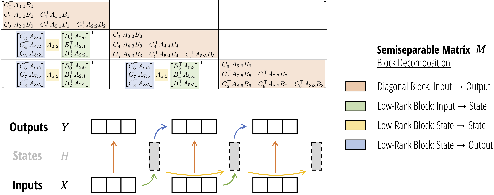

# Mamba


> **Mamba: Linear-Time Sequence Modeling with Selective State Spaces**\
> Albert Gu*, Tri Dao*\
> Paper: https://arxiv.org/abs/2312.00752


> **Transformers are SSMs: Generalized Models and Efficient Algorithms**\
>     **Through Structured State Space Duality**\
> Tri Dao*, Albert Gu*\
> Paper: https://arxiv.org/abs/2405.21060

## About

Mamba is a new state space model architecture showing promising performance on information-dense data such as language modeling, where previous subquadratic models fall short of Transformers.
It is based on the line of progress on [structured state space models](https://github.com/state-spaces/s4),
with an efficient hardware-aware design and implementation in the spirit of [FlashAttention](https://github.com/Dao-AILab/flash-attention).

## Installation

- [Option] `pip install causal-conv1d>=1.4.0`: an efficient implementation of a simple causal Conv1d layer used inside the Mamba block.
- `pip install mamba-ssm`: the core Mamba package.

It can also be built from source with `pip install .` from this repository.

If `pip` complains about PyTorch versions, try passing `--no-build-isolation` to `pip`.

Other requirements:
- Linux
- NVIDIA GPU
- PyTorch 1.12+
- CUDA 11.6+

For AMD cards, see additional prerequisites below.

## Usage

We expose several levels of interface with the Mamba model.

### Selective SSM

Mamba is based on a selective SSM layer, which is the focus of the paper (Section 3; Algorithm 2).

Source: [ops/selective_scan_interface.py](mamba_ssm/ops/selective_scan_interface.py).

### Mamba Block

The main module of this repository is the Mamba architecture block wrapping the selective SSM.

Source: [modules/mamba_simple.py](mamba_ssm/modules/mamba_simple.py).

Usage:
``` python
import torch
from mamba_ssm import Mamba

batch, length, dim = 2, 64, 16
x = torch.randn(batch, length, dim).to("cuda")
model = Mamba(
    # This module uses roughly 3 * expand * d_model^2 parameters
    d_model=dim, # Model dimension d_model
    d_state=16,  # SSM state expansion factor
    d_conv=4,    # Local convolution width
    expand=2,    # Block expansion factor
).to("cuda")
y = model(x)
assert y.shape == x.shape
```

### Mamba-2

The Mamba-2 block is implemented at [modules/mamba2.py](mamba_ssm/modules/mamba2.py).

A simpler version is at [modules/mamba2_simple.py](mamba_ssm/modules/mamba2_simple.py)

The usage is similar to Mamba(-1):
``` python
from mamba_ssm import Mamba2
model = Mamba2(
    # This module uses roughly 3 * expand * d_model^2 parameters
    d_model=dim, # Model dimension d_model
    d_state=64,  # SSM state expansion factor, typically 64 or 128
    d_conv=4,    # Local convolution width
    expand=2,    # Block expansion factor
).to("cuda")
y = model(x)
assert y.shape == x.shape
```

#### SSD

A minimal version of the inner SSD module (Listing 1 from the Mamba-2 paper) with conversion between "discrete" and "continuous" SSM versions
is at [modules/ssd_minimal.py](mamba_ssm/modules/ssd_minimal.py).

### Mamba Language Model

Finally, we provide an example of a complete language model: a deep sequence model backbone (with repeating Mamba blocks) + language model head.

Source: [models/mixer_seq_simple.py](mamba_ssm/models/mixer_seq_simple.py).

This is an example of how to integrate Mamba into an end-to-end neural network.
This example is used in the generation scripts below.


## Pretrained Models

Pretrained models are uploaded to
[Hugging Face](https://huggingface.co/state-spaces): `mamba-130m`, `mamba-370m`,
`mamba-790m`, `mamba-1.4b`, `mamba-2.8b`, `mamba2-130m`, `mamba2-370m`,
`mamba2-780m`, `mamba2-1.3b`, `mamba2-2.7b`, `transformerpp-2.7b`, `mamba2attn-2.7b`, trained on 300B tokens on the Pile, as well as `mamba-2.8b-slimpj`
(trained on 600B tokens on the SlimPajama dataset).


The models will be autodownloaded by the generation script below.

These models were trained on the [Pile](https://huggingface.co/datasets/EleutherAI/pile), and follow the standard model dimensions described by GPT-3 and followed by many open source models:

| Parameters | Layers | Model dim. | 
|------------|--------|------------|
| 130M       | 24     | 768        |
| 370M       | 48     | 1024       |
| 790M       | 48     | 1536       |
| 1.4B       | 48     | 2048       |
| 2.8B       | 64     | 2560       |

(The layer count of Mamba doubles that of a Transformer with similar size, as two Mamba blocks are needed for each "layer" (MHA block + MLP block) of a Transformer.)

Note: these are base models trained only for 300B tokens, without any form of downstream modification (instruction tuning, etc.).
Performance is expected to be comparable or better than other architectures trained on similar data, but not to match larger or fine-tuned models.


## Evaluations

To run zero-shot evaluations of models (corresponding to Table 3 of the paper),
we use the
[lm-evaluation-harness](https://github.com/EleutherAI/lm-evaluation-harness)
library.

1. Install `lm-evaluation-harness` by `pip install lm-eval==0.4.2`.
2. Run evaluation with (more documentation at the [lm-evaluation-harness](https://github.com/EleutherAI/lm-evaluation-harness/tree/big-refactor) repo):
``` sh
lm_eval --model mamba_ssm --model_args pretrained=state-spaces/mamba-130m --tasks lambada_openai,hellaswag,piqa,arc_easy,arc_challenge,winogrande,openbookqa --device cuda --batch_size 256
python evals/lm_harness_eval.py --model hf --model_args pretrained=EleutherAI/pythia-160m --tasks lambada_openai,hellaswag,piqa,arc_easy,arc_challenge,winogrande --device cuda --batch_size 64
```

To reproduce the results on the `mamba-2.8b-slimpj` model reported in the blogposts:
``` sh
lm_eval --model mamba_ssm --model_args pretrained=state-spaces/mamba-2.8b-slimpj --tasks boolq,piqa,hellaswag,winogrande,arc_easy,arc_challenge,openbookqa,race,truthfulqa_mc2 --device cuda --batch_size 256
lm_eval --model mamba_ssm --model_args pretrained=state-spaces/mamba-2.8b-slimpj --tasks mmlu --num_fewshot 5 --device cuda --batch_size 256
```

To run evaluations on Mamba-2 models, simply replace the model names:
``` sh
lm_eval --model mamba_ssm --model_args pretrained=state-spaces/mamba2-2.7b --tasks lambada_openai,hellaswag,piqa,arc_easy,arc_challenge,winogrande,openbookqa --device cuda --batch_size 256
lm_eval --model mamba_ssm --model_args pretrained=state-spaces/transformerpp-2.7b --tasks lambada_openai,hellaswag,piqa,arc_easy,arc_challenge,winogrande,openbookqa --device cuda --batch_size 256
lm_eval --model mamba_ssm --model_args pretrained=state-spaces/mamba2attn-2.7b --tasks lambada_openai,hellaswag,piqa,arc_easy,arc_challenge,winogrande,openbookqa --device cuda --batch_size 256
```

Note that the result of each task might differ from reported values by 0.1-0.3 due to noise in the evaluation process.

## Inference

The script [benchmarks/benchmark_generation_mamba_simple.py](benchmarks/benchmark_generation_mamba_simple.py)
1. autoloads a model from the Hugging Face Hub,
2. generates completions of a user-specified prompt,
3. benchmarks the inference speed of this generation.

Other configurable options include the top-p (nucleus sampling) probability, and the softmax temperature.

### Examples

To test generation latency (e.g. batch size = 1) with different sampling strategies:

``` sh
python benchmarks/benchmark_generation_mamba_simple.py --model-name "state-spaces/mamba-2.8b" --prompt "My cat wrote all this CUDA code for a new language model and" --topp 0.9 --temperature 0.7 --repetition-penalty 1.2
python benchmarks/benchmark_generation_mamba_simple.py --model-name "EleutherAI/pythia-2.8b" --prompt "My cat wrote all this CUDA code for a new language model and" --topp 0.9 --temperature 0.7 --repetition-penalty 1.2
python benchmarks/benchmark_generation_mamba_simple.py --model-name "state-spaces/mamba-2.8b" --prompt "My cat wrote all this CUDA code for a new language model and" --minp 0.05 --topk 0 --temperature 0.7 --repetition-penalty 1.2
```

To test generation throughput with random prompts (e.g. large batch size):
``` sh
python benchmarks/benchmark_generation_mamba_simple.py --model-name "state-spaces/mamba-2.8b" --batch 64
python benchmarks/benchmark_generation_mamba_simple.py --model-name "EleutherAI/pythia-2.8b" --batch 64
```

With Mamba-2, you just need to change the model name:
``` sh
python benchmarks/benchmark_generation_mamba_simple.py --model-name "state-spaces/mamba2-2.7b" --prompt "My cat wrote all this CUDA code for a new language model and" --topp 0.9 --temperature 0.7 --repetition-penalty 1.2
```


## Troubleshooting

### Precision
Our models were trained using PyTorch [AMP](https://pytorch.org/docs/stable/amp.html) for mixed precision. AMP keeps model parameters in float32 and casts to half precision when necessary.
On the other hand, other frameworks like DeepSpeed store parameters in float16 and upcasts when necessary (e.g. for optimizer accumulation).

We've observed that higher precision for the main model parameters may be necessary, because SSMs are sensitive to their recurrent dynamics. If you are experiencing instabilities,
as a first step please try a framework storing parameters in fp32 (such as AMP).

### Initialization
Some parts of the model have initializations inherited from prior work on S4 models.
For [example](https://github.com/state-spaces/mamba/blob/f0affcf69f06d1d06cef018ff640bf080a11c421/mamba_ssm/modules/mamba_simple.py#L102), the $\Delta$ parameter has a targeted range by initializing the bias of its linear projection.
However, some frameworks may have post-initialization hooks (e.g. setting all bias terms in `nn.Linear` modules to zero).
If this is the case, you may have to add custom logic (e.g. this [line](https://github.com/state-spaces/mamba/blob/f0affcf69f06d1d06cef018ff640bf080a11c421/mamba_ssm/modules/mamba_simple.py#L104) turns off re-initializing in our trainer, but would be a no-op in any other framework)
that is specific to the training framework.

## Additional Prerequisites for AMD cards

### Patching ROCm

If you are on ROCm 6.0, run the following steps to avoid errors during compilation. This is not required for ROCm 6.1 onwards.

1. Locate your ROCm installation directory. This is typically found at `/opt/rocm/`, but may vary depending on your installation.

2. Apply the Patch. Run with `sudo` in case you encounter permission issues.
   ```bash
    patch /opt/rocm/include/hip/amd_detail/amd_hip_bf16.h < rocm_patch/rocm6_0.patch 
   ```


## Citation

If you use this codebase, or otherwise find our work valuable, please cite Mamba:
```
@article{mamba,
  title={Mamba: Linear-Time Sequence Modeling with Selective State Spaces},
  author={Gu, Albert and Dao, Tri},
  journal={arXiv preprint arXiv:2312.00752},
  year={2023}
}

@inproceedings{mamba2,
  title={Transformers are {SSM}s: Generalized Models and Efficient Algorithms Through Structured State Space Duality},
  author={Dao, Tri and Gu, Albert},
  booktitle={International Conference on Machine Learning (ICML)},
  year={2024}
}

```
