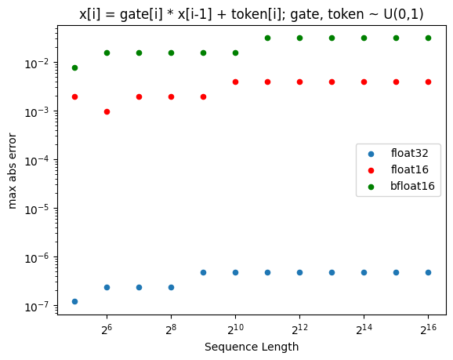

# Accelerated Scan

[](https://pypi.python.org/pypi/accelerated-scan) [](https://zenodo.org/doi/10.5281/zenodo.10600962)


This package implements the fastest [first-order parallel associative scan](https://www.cs.cmu.edu/~guyb/papers/Ble93.pdf) on the GPU for forward and [backward](https://arxiv.org/abs/1709.04057).

The scan efficiently solves first-order recurrences of the form `x[t] = gate[t] * x[t-1] + token[t]`, common in state space models and linear RNNs.

The `accelerated_scan.warp` C++ CUDA kernel uses a chunked processing algorithm that leverages the fastest GPU communication primitives available
on each level of hierarchy: [warp shuffles](https://developer.nvidia.com/blog/using-cuda-warp-level-primitives/) within warps of 32 threads and shared memory (SRAM) between warps within a thread block. One sequence per channel dimension is confined to one thread block.

The derivation of [Chunked Scan](https://proger.github.io/posts/scan/chunk.html) has been used to extend tree-level Blelloch algorithm to block.

A similar implementation is available in `accelerated_scan.triton` using a Triton's `tl.associative_scan` primitive. It [requires Triton 2.2 for its `enable_fp_fusion` flag](https://twitter.com/darkproger/status/1742663555835363635).

Quick Start:

```bash
pip install accelerated-scan
```

```python
import torch
from accelerated_scan.warp import scan # a pure c++ kernel, faster than cub
#from accelerated_scan.triton import scan # uses tl.associative_scan
#from accelerated_scan.ref import scan # reference torch implementation

# sequence lengths must be a power of 2 of lengths between 32 and 65536
# hit me up if you need different lengths!

batch_size, dim, seqlen = 3, 1536, 4096
gates = 0.999 + 0.001 * torch.rand(batch_size, dim, seqlen, device="cuda")
tokens = torch.rand(batch_size, dim, seqlen, device="cuda")

out = scan(gates, tokens)
```

To ensure numerical equivalence, a reference implementation for trees is provided in Torch. It can be sped up using `torch.compile`.

## Benchmarks:


See more benchmarks in nanokitchen: https://github.com/proger/nanokitchen


forward speed of (8,1536,seqlen), inference mode:
```
   SEQUENCE_LENGTH  accelerated_scan.triton (triton 2.2.0)  accelerated_scan.ref  accelerated_scan.warp
0            128.0                                0.027382              0.380874               0.026844
1            256.0                                0.049104              0.567916               0.048593
2            512.0                                0.093008              1.067906               0.092923
3           1024.0                                0.181856              2.048471               0.183581
4           2048.0                                0.358250              3.995369               0.355414
5           4096.0                                0.713511              7.897022               0.714536
6           8192.0                                1.433052             15.698944               1.411390
7          16384.0                                3.260965             31.305046               2.817152
8          32768.0                               31.459671             62.557182               5.645697
9          65536.0                               66.787331            125.208572              11.297921
```

## Notes on Precision

When gates and tokens are sampled uniformly from 0..1 the lack of bfloat16 precision dominates the error (compared to the reference implementation):


