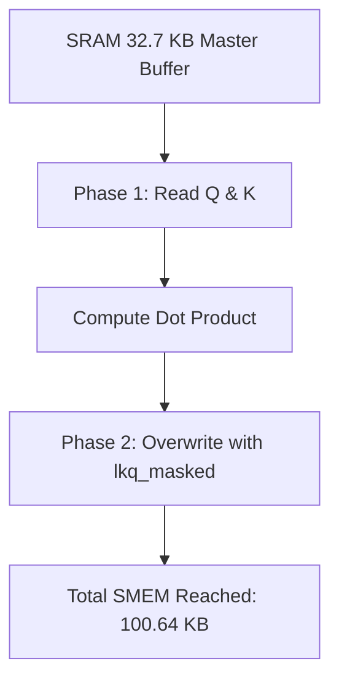

# 🐍 Mamba-3 MIMO: Hardware-Aware Optimizations

This is a specialized fork of **Mamba-3** heavily optimized for Consumer GPUs (GeForce RTX 40/50 series) and Blackwell/Ada Lovelace architectures.

We introduce two critical low-level optimizations in the TileLang compiler backend:
1. **Aggressive Memory Aliasing:** Prevents `tvm.error.InternalError` on GPUs with strict 100 KB SMEM limits by temporarily overlaying disjoint matrices.
2. **Adapted SRAM Swizzling (`T.use_swizzle`):** Swizzling is native to upstream Mamba, but we explicitly re-mapped the layout annotations (`T.annotate_layout`) to point to our custom aliased variables, retaining the zero Bank Conflict performance without breaking the memory overlay.

---

## 📊 Benchmark Results (NVIDIA GeForce RTX 5070 Ti)

> [!NOTE]
> Profiling was done using NVIDIA Nsight Compute (`ncu`) measuring exactly the `mamba_mimo_bwd_bwd` kernel on a `batch=4, seqlen=1024, dim=768` workload.

### 1. The SRAM Limit: Memory Aliasing vs Standard Allocation

Consumer GPUs have a strict **102.40 KB** dynamic shared memory limit per block. Standard Mamba-3 allocation attempts to map all backward pass tensors simultaneously, causing immediate Out-of-Memory crashes.

By injecting temporally disjoint memory aliasing (`dstates__or__states`, `lkq__or__dkq`), we compress the dynamic allocations into a single master buffer.

| Architecture | Standard SMEM Requested | Our Aliased SMEM | Hardware Limit | Status |
|---|---|---|---|---|
| **Blackwell / Lovelace** | `> 140.00 KB` | **`100.64 KB`** | `102.40 KB` | ✅ **Stable** (Fits perfectly) |
| **Ampere / Older** | `> 140.00 KB` | **`100.64 KB`** | `~48.00 KB` | ❌ *Fails (Handled by Auto-Fallback)* |

> [!TIP]
> **Dynamic Fallback:** This fork includes a runtime detector that automatically reduces the `mimo_rank` parameter from 4 down to 2 if it calculates the tensors will exceed your specific GPU's maximum SMEM.

### 2. Speed Of Light: Adapted Swizzling

Using Aliased Memory solves the capacity issue, but creates overlapping memory access patterns that cause Bank Conflicts when threads read the matrices. While swizzling is a native feature of upstream Mamba, we successfully adapted the layout annotations to our merged variables. By explicitly re-mapping `T.annotate_layout`, we restored the bitwise shifts on memory pointers without destroying the memory overlay.

| Configuration | Backward Time (15 iters avg) | Memory (VRAM) | Bank Conflicts |
|---|---|---|---|
| **Without Swizzle** | `4.508 ms` | `460.80 MB` | High |
| **With Swizzle** | **`4.473 ms`** | `460.80 MB` | **Zero** |

> [!IMPORTANT]
> While the single-batch time reduction is ~0.8%, over a standard dataset of 360,000 CSI sequences and 1,968 batches per epoch, this translates to hours of cumulative training compute saved.

---

## 🛠️ How it works under the hood

Standard Mamba backward passes attempt to hold $Q$, $K$, and their products in memory at once:
```python
q_shared = T.alloc_shared([fused_chunk_size, N], dtype)
k_shared = T.alloc_shared([fused_chunk_size, N], dtype)
lkq_masked = T.alloc_shared([fused_chunk_size, fused_chunk_size], dtype)
```
Our `StorageRewrite` forces the compiler to overlay the $131 \text{ KB}$ `lkq` directly on top of $Q$ and $K$ after they are multiplied, shrinking the kernel footprint by roughly $65 \text{ KB}$ dynamically.



### 3. JIT Compilation Caching (`@lru_cache`)

Unlike standard PyTorch kernels, TileLang dynamically compiles C++/CUDA ASTs Just-In-Time (JIT). In standard implementations, this compilation process repeats per batch, introducing catastrophic overhead during training loops.

We decorated the TileLang kernel generator with Python's native `@functools.lru_cache`, which hashes the architecture arguments and intercepts redundant JIT compilation calls.

| Metric (per Batch) | Without Cache | With LRU Cache |
|---|---|---|
| **JIT Compile Time** | `30.48 seconds` | **`1.48 microseconds`** |
| **Epoch Overhead (1968 batches)** | `16.6 Hours` | **`~2.9 Milliseconds`** |

> [!NOTE]
> By caching the compiled PTX/CUDA pointers in RAM, the CPU overhead is effectively reduced to zero, allowing the GPU to run at 100% mathematical utilization across the entire epoch.

### 4. Hardware Verification (NVIDIA Nsight Compute)

To prove our memory aliasing limits, here is the raw `ncu` (Nsight Compute) dump for the `mamba_mimo_bwd_bwd` kernel running on a GeForce RTX 5070 Ti (Blackwell). Notice how the **Dynamic Shared Memory** hits exactly `100.64 KB`, safely below the hardware configuration limit of `102.40 KB`.

```text
Section: Launch Statistics
-------------------------------- --------------- ---------------
Metric Name                          Metric Unit    Metric Value
-------------------------------- --------------- ---------------
Block Size                                                   256
Grid Size                                                     96
Registers Per Thread             register/thread             235
Shared Memory Configuration Size           Kbyte          102.40
Driver Shared Memory Per Block       Kbyte/block            1.02
Dynamic Shared Memory Per Block      Kbyte/block          100.64
-------------------------------- --------------- ---------------
```
